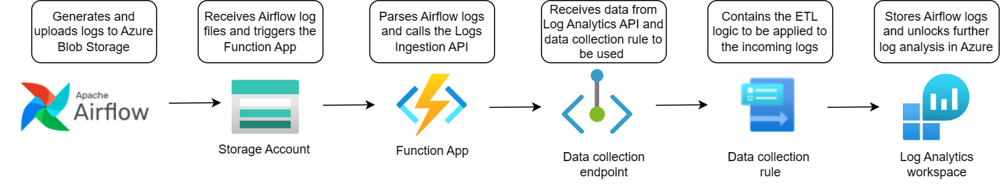
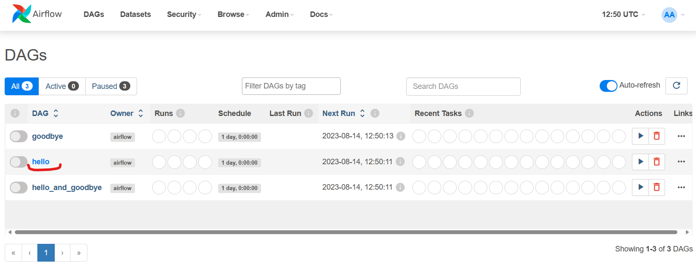
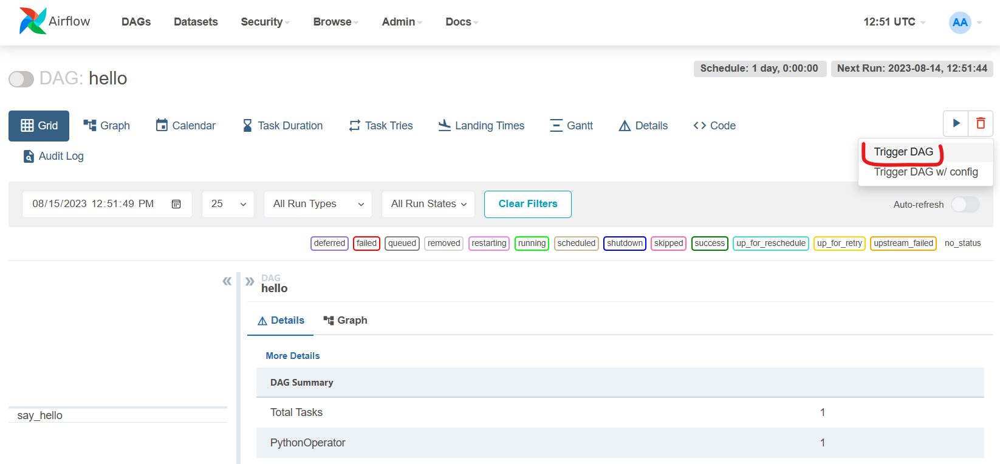
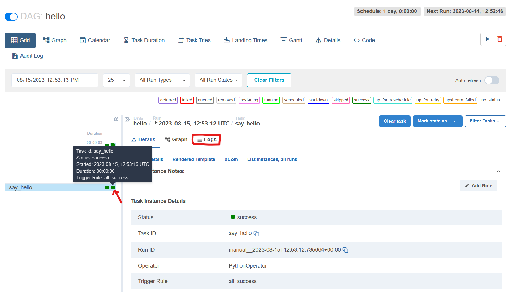
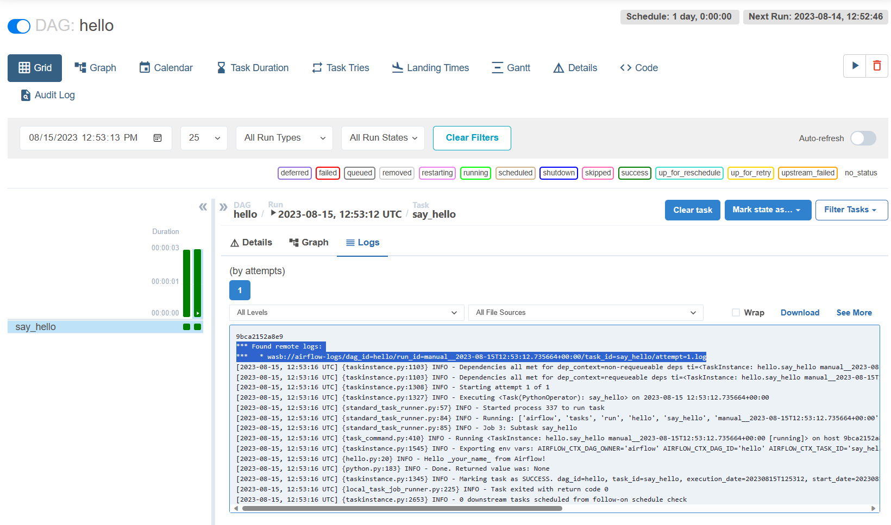
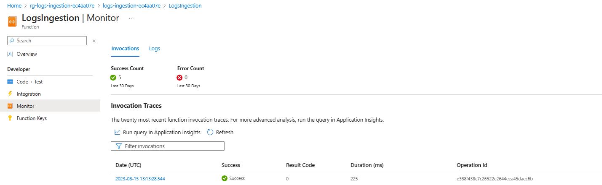
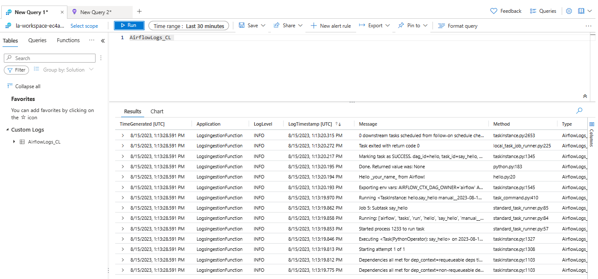

# Azure Observability in Airflow Sample

- [Azure Observability in Airflow Sample](#azure-observability-in-airflow-sample)
  - [TLDR](#tldr)
  - [Overview](#overview)
  - [Architecture overview](#architecture-overview)
  - [Setup](#setup)
    - [Prerequisites](#prerequisites)
    - [Quick setup](#quick-setup)
    - [Generate and view logs](#generate-and-view-logs)
    - [(Alternatively) Step-by-step setup](#alternatively-step-by-step-setup)
      - [Create infrastructure](#create-infrastructure)
      - [Start Airflow](#start-airflow)
  - [Clean-up](#clean-up)

## TLDR

This sample demonstrates how to send Apache Airflow logs to an Azure Log Analytics workspace using the Azure Monitor Log Ingestion API.

## Overview

[Apache Airflow](https://airflow.apache.org/docs/apache-airflow/stable/index.html) is an open-source platform for developing, scheduling, and monitoring batch-oriented workflows. By default, Airflow supports logging into the local file system, which is suitable for development environments and for quick debugging. For production scenarios it is recommended to use persistent logs storage. Thus, in this sample there is an end-to-end setup of sending Airflow logs into Azure Monitor, so they can be easily analyzed.

This sample shows two parts:

1. Airflow configuration to send logs to Azure Blob Storage (it is based on [this documentation](https://airflow.apache.org/docs/apache-airflow-providers-microsoft-azure/stable/logging/index.html#writing-logs-to-azure-blob-storage)),
2. Ingesting logs from Azure Blob Storage into Azure Monitor using a new ETL-like data collection pipeline
with [Data Collection Rule](https://learn.microsoft.com/en-us/azure/azure-monitor/essentials/data-collection-rule-overview), [Data Collection Endpoint](https://learn.microsoft.com/en-us/azure/azure-monitor/essentials/data-collection-endpoint-overview) and [Logs Ingestion API](https://learn.microsoft.com/en-us/azure/azure-monitor/logs/logs-ingestion-api-overview).

Apache Airflow runs as a Docker compose project, and the required Azure infrastructure is created using terraform.

## Architecture overview



Whenever an Apache workflow is triggered a new log file is created and uploaded to Azure Blob Storage.
This causes a `LogIngestion` Azure Function to be triggered.

The function uses the Azure Monitor Ingestion client library for .NET. It sets up a Logs Ingestion client with previously created data collection endpoint. And it calls the Logs Ingestion API specifying parsed data from Blob Storage files (aka source data) and a data collection rule id.
The data collection rule understands the structure of the source data, transforms the data to a format expected by the target table, and specifies a Log Analytics workspace and table to send the transformed data (it is a custom Log Analytics table called `AirflowLogs_CL`).

For more details about the Logs Ingestion API, check [this documentation](https://learn.microsoft.com/en-us/azure/azure-monitor/logs/logs-ingestion-api-overview).

## Setup

### Prerequisites

* [Docker](https://docs.docker.com/get-docker/)
* Azure subscription
* [Azure CLI](https://learn.microsoft.com/en-us/cli/azure/install-azure-cli) (at least the version 2.47)
* [Terraform](https://developer.hashicorp.com/terraform/downloads) (at least the version 1.5.4)
* [.NET](https://dotnet.microsoft.com/en-us/download) (at least the version 6.0)

### Quick setup

To prepare the required Azure infrastructure and start Apache Airflow components, run:

```bash
cd src
./run_all_in_one.sh 
```

### Generate and view logs

Follow the steps returned in the output of the previous step and log in to Airflow.

You will see tree available DAG workflows. Open one of them by clicking on its name:


Trigger it with `Trigger DAG` button.


There should be at least one task executed, click on it to make the Logs button appear.


Click the Logs button and you should see `Found remote logs` message, which indicates that the log file was sent to a configured Azure Blob Storage.


Go to the Azure portal, you should see a new resource group starting with `rg-logs-ingestion`. Check that the Log Ingestion Azure Function was triggered successfully (usually there is a 5 min delay until past executions show up):



Finally, open the Log Analytics workspace from the same resource group and run the query against the `AirflowLogs_CL` table, where you will find Airflow logs.



### (Alternatively) Step-by-step setup

#### Create infrastructure

1. Open command line and navigate to directory containing the infra code: `cd src/infra`
2. Login into your Azure subscription: `az login`
3. Init terraform: `terraform init`
4. Provision infrastructure: `terraform apply`
5. Use the returned values in your `.env` file: `terraform output -json`

#### Start Airflow

To start application

```bash
cd src
docker compose up --build -d
```

Follow steps from the [Generate and view logs section](#generate-and-view-logs).

## Clean-up

To delete the Azure infrastructure, stop and delete Airflow containers, cached Docker images and volumes execute:

```bash
./remove_all.sh
```
